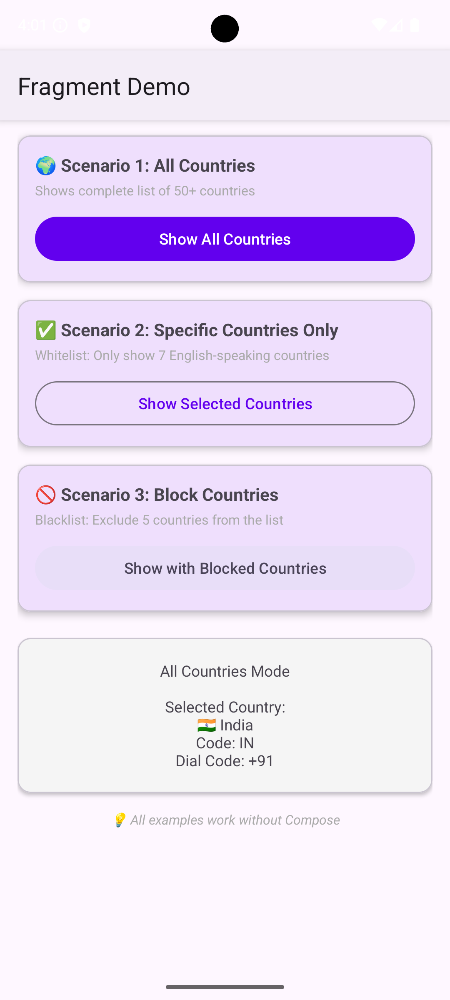
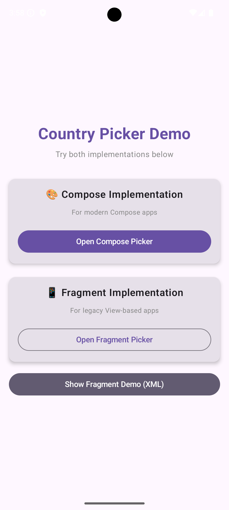
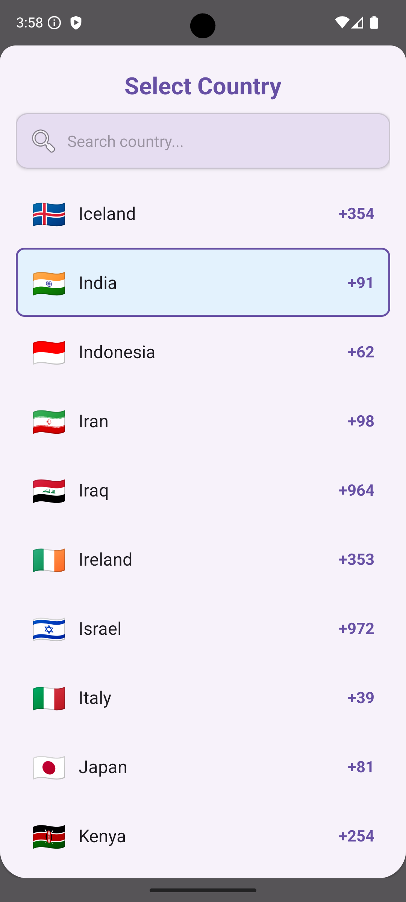

# 🌍 Country Picker Library for Android

[](https://opensource.org/licenses/MIT)
[](https://android-arsenal.com/api?level=24)
[](https://kotlinlang.org)
[](https://developer.android.com/jetpack/compose)
[](https://jitpack.io/#Jaypatelbond/CountryPicker)

A beautiful, fully customizable country picker component for Android with Jetpack Compose support.

<p align="center">
  
  
  
</p>


## ✨ Features

- 🎨 **Fully Customizable** - Colors, fonts, shapes.
- 🔍 **Smart Search** - Filter by name, code, or dial code.
- 🌍 **50+ Countries** - Built-in list with flags.
- 📱 **Material Design 3** - Modern UI.
- ⚡ **Lightweight** - Pure Kotlin & Compose.

## 📦 Installation

Add to your module's `build.gradle.kts`:

```kotlin
dependencies {
    // For Jetpack Compose
    implementation("com.github.Jaypatelbond.CountryPicker:compose:v1.1.0")

    // For Views / Fragments
    implementation("com.github.Jaypatelbond.CountryPicker:view:v1.1.0")
    
    // Core (Data only)
    implementation("com.github.Jaypatelbond.CountryPicker:core:v1.1.0")
}
```

## 🚀 Quick Start (Compose)

```kotlin
@Composable
fun MyScreen() {
    var showPicker by remember { mutableStateOf(false) }
    var selectedCountry by remember { mutableStateOf<Country?>(null) }

    Button(onClick = { showPicker = true }) {
        Text("Select Country")
    }

    if (showPicker) {
        CountryPickerBottomSheet(
            onDismiss = { showPicker = false },
            onCountrySelected = { country ->
                selectedCountry = country
                showPicker = false
            }
        )
    }
}
```

## 🎨 Customization

Customize the look and feel easily:

```kotlin
CountryPickerBottomSheet(
    onDismiss = { showPicker = false },
    onCountrySelected = { /* ... */ },
    style = CountryPickerStyle(
        titleText = "Select Location",
        titleColor = Color(0xFF6200EE),
        searchHintText = "Search...",
        enableItemAnimation = true
    )
)
```

## 🎯 Filtering

You can show all countries, a specific list, or block certain ones.

```kotlin
// Show only specific countries
val europeanCountries = listOf(
    Country("France", "FR", "+33"),
    Country("Germany", "DE", "+49")
)

CountryPickerBottomSheet(
    // ...
    customCountryList = europeanCountries
)
```

## 📱 Legacy Support (Fragments/Views)

<details>
<summary>Click to expand Fragment implementation details</summary>

### From Activity/Fragment

```kotlin
val picker = CountryPickerBottomSheetFragment().apply {
    onCountrySelectedListener = { country ->
        Toast.makeText(context, "Selected: ${country.name}", Toast.LENGTH_SHORT).show()
    }
}
picker.show(supportFragmentManager, "CountryPicker")
```

</details>

## 🤝 Contributing

Contributions are welcome! See [CONTRIBUTING.md](CONTRIBUTING.md) for guidelines.

## 📄 License

MIT License. See [LICENSE](LICENSE) for details.
